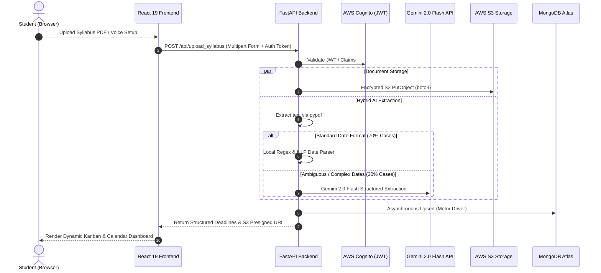

# GRYPH OS — Hybrid AI Academic Operating System

[](https://frontend-omega-gilt-47.vercel.app/onboarding)
[](https://devpost.com/software/gryph-os)
[](https://react.dev/)
[](https://fastapi.tiangolo.com/)
[](docker-compose.yml)
[](https://aws.amazon.com/)
[](LICENSE)

> Transforms unstructured course syllabi PDFs into dynamic, synchronized academic calendars, Kanban boards, and task feeds within seconds.

---

## Overview

At the beginning of each university semester, students spend hours manually reading 10–20 page syllabus PDFs to extract assignment due dates, quiz schedules, and exam dates into their calendars.

**GRYPH OS** automates this entire pipeline. Drop any course syllabus PDF into the interface, and our hybrid AI extraction engine parses course metadata, chronologically orders deadlines, and generates an interactive semester dashboard with zero manual data entry.

---

## Key Features & Architecture

- **70/30 Hybrid Parsing Architecture:**
  Combines local `pypdf` extraction and custom Regular Expression tokenization with **Google Gemini 2.0 Flash LLM API**. The local regex pipeline handles ~70% of standardized date formats locally, routing only ambiguous 30% cases to the LLM—**slashing API cost and cloud response latency by 70%**.
- **Voice-First Conversational Onboarding:**
  Integrates the browser-native **Web Speech API** for hands-free audio onboarding with our AI assistant *"Gryph"*, capturing student semester goals without static web forms.
- **Real-Time Academic Dashboards:**
  Auto-generates synchronized **Interactive Kanban Boards**, **Calendar Feeds**, and **Grade Distribution Visualizers**.
- **Academic Integrity Guardrails:**
  Includes custom validation heuristics that analyze uploaded documents and reject proprietary exam/test papers to ensure ethical academic use.
- **Cloud-Native & Secure:**
  Utilizes **AWS Cognito** for secure JWT/JWKS token authentication, **AWS S3** with AES-256 server-side encryption for syllabus document storage, and **MongoDB Atlas (Motor)** for asynchronous, non-blocking persistence.

---

## System Data Flow



---

## Tech Stack

| Domain | Technologies |
| :--- | :--- |
| **Frontend** | React 19 SPA, CRACO, Tailwind CSS, Radix UI, Framer Motion, Nginx, Web Speech API |
| **Backend** | Python 3.11, FastAPI, Pydantic, Motor (Async MongoDB), Boto3, `pypdf` |
| **AI / NLP & Voice** | Google Gemini 2.0/2.5 API, Vapi.ai Telephony, Deepgram Nova-2 |
| **Cloud & DevOps** | Docker, Docker Compose, AWS S3, AWS Cognito, MongoDB 7.0, GitHub Actions CI |

---

## Quickstart & Local Setup

### Option 1: One-Click Docker Setup (Recommended)

Requires [Docker Desktop](https://www.docker.com/products/docker-desktop/) installed and running.

1. **Clone the repository:**
   ```bash
   git clone https://github.com/SoumyA4348/GryphOS.git
   cd GryphOS
   ```

2. **(Optional) Configure environment credentials:**
   ```bash
   cp backend/.env.example backend/.env
   # Edit backend/.env to add your Gemini and AWS credentials
   ```

3. **Build and launch all services:**
   ```bash
   docker compose up --build
   ```

   *Services started:*
   - **Frontend UI:** [http://localhost:3000](http://localhost:3000) (served via Nginx)
   - **Backend API & Docs:** [http://localhost:8000/docs](http://localhost:8000/docs) (FastAPI Swagger)
   - **API Health Check:** [http://localhost:8000/api/health](http://localhost:8000/api/health)
   - **Database:** MongoDB 7.0 (internal port `27017` with healthcheck)

4. **Stop services:**
   ```bash
   docker compose down
   ```

---

### Option 2: Manual Local Setup

#### Prerequisites
- **Python 3.11+**
- **Node.js 20+** & **Yarn** (or npm)
- Local or cloud **MongoDB** instance (e.g. MongoDB Atlas)

#### 1. Backend Setup
```bash
cd backend

# Create and activate virtual environment
python -m venv .venv
source .venv/bin/activate       # On Windows: .venv\Scripts\activate

# Install dependencies
pip install -r requirements.txt

# Create .env from template
cp .env.example .env
# Ensure MONGO_URL and EMERGENT_LLM_KEY are set

# Launch development server
uvicorn server:app --reload --port 8000
```

#### 2. Frontend Setup
```bash
cd frontend

# Install dependencies (Yarn recommended)
yarn install
# Or with npm: npm install --legacy-peer-deps

# Start React development server
yarn start
# Or with npm: npm start
```

Open [http://localhost:3000](http://localhost:3000) in your browser.

---

## Authors & Contributors

* **Soumya Patel** — *Full-Stack Architecture, Hybrid Parser Pipeline & Cloud Integration* — [@SoumyA4348](https://github.com/SoumyA4348)
* **Manas Verma** — *Frontend UI/UX & AI Assistant Integration* — [@Mv2002v](https://github.com/Mv2002v)

*Built collaboratively in 24 hours during **GDG Hacks 3 (May 2026)**.*  
*[Devpost Project Showcase](https://devpost.com/software/gryph-os)*

---

## License

This project is licensed under the MIT License — see the [LICENSE](LICENSE) file for details.
